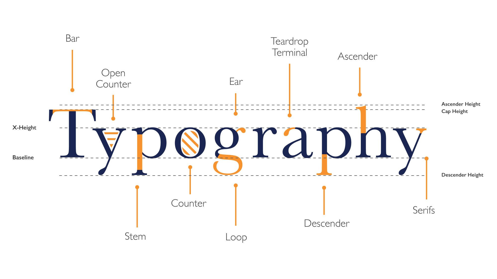

# Typography
Typography
----------

The study of using typefaces and layouts to better communicate.

### Font vs typefaces

Typefaces are the family of fonts, like helvetica and futura. Fonts are the specific variation of typefaces, like 10 point bold helvetica.

Parts of a font
---------------

Choosing typefaces
------------------

### Serif and Sans-serif

The first question to ask is do you want a classical look or contemporary. If classical pick serif-ed fonts. And vice versa  
serif = old and classic  
sans-serif = contemporary or new

### Common types and new common types

There are some types that are so prevalent that you can't go wrong with choosing them most of the time.

*   **Garamond**: for the intellectual
*   **Bodoni**: For Elegant and fancy stuff
*   **Century** Expanded: for best legibility
*   **Futura**: for the modern minimalist
*   **Times** Roman: for the default
*   **Helvetica**: the most versatile font

[More common fonts found here](#https://blog.spoongraphics.co.uk/articles/25-classic-fonts-that-will-last-a-whole-design-career)

### Limit your choices

Often best to use 1 or 2 fonts. Use one font when in doubt.

### For unconventional choices

[see here](#https://www.youworkforthem.com) 

A great resource for seeing great unconventional type choices

Layout and hierarchy
--------------------

There are many things to keep in mind with laying out typefaces

### Sizes

Pick a base size first. usually 16px in your case. And all your other sizes should be based on that.  lIke 2x or 4x of that.

Use [type-scale.com](https://type-scale.com/)  to see other scales systems of type. 

### Line weight

Best to skip a weight for contrast and hierachy

### Avoid the corners

Types need negative space. Break this rule when you understand why  you need to break it

### Align to lines. 

Align to common baselines and column lines. Order makes things look tidy and in harmony