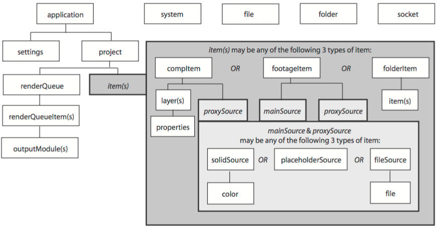

# AfterEffects
**\-|- After Effects Automation**
---------------------------------

The main scripting language in after effect is extendScript. Which is essentially javascript with Adobe's added classes. Not moden javascript though. This is like 1990s javascript.

**Running scripts**
-------------------

Most straightforward way is just going to After Effects and File > Scripts > Run Script. Then pick you script from the file picker.

Ctrl+Alt+Shift+D to run the most recent picked script.

There are other ways of running it but I won't bother for now. and it's just so goddamn buggy:

**After Effects Object Model**
------------------------------



**Undo Group**
--------------

This controls at what points of the script, is a task undoable.

```text-plain
function SomeTask(){
  beginUndoGroup();
  // your operations here 
  endUndoGroup();
}
```

Most of the time you don't need the begin undo group

```text-plain
function SomeTask(){
  // your operations here 
  endUndoGroup();
}
```

**Navigating After Effects Objects**
------------------------------------

It's a series of nested objects. like from app> project > item > effect > property

General structure that you need is

*   app
    *   project
        *   compItem
            *   layers
                *   effect
                    *   property

**General navigation**

There will be some times when you don't know the full chain. you can navigate by the propery() function.

```text-plain
// by full property name
someObject.property("Property Name"); 

// by index
someObject.property(1); // note indeces start with 1 in AE. Just because
```

**Gettting the project object**

```text-plain
var project = app.project;
```

**Getting the a project item like comps/video**

```text-plain
var item = project.item(1) // take by index
```

in the AE project panel you will see a column array of items. that's the order of the array

**Getting layer objects from comps**

```text-plain
var layer = compItem.layer(1) // take by index
```

in the AE timeline you will see a column array of items. that's the order of the array

**Getting an effects object a layer**

```text-plain
var effect = layer.effect(1) // take by index
```

in the AE effects panel you will see a column array of items. that's the order of the array

**Getting and settting an effect property**

```text-plain
property.setValue({value});  //Set property value
property.value;  //Get property value
```

**Can't get the full path?**

Open the expression Editor then you will see some of the full path. That should be a good pointer.

**Render-queue**
----------------

**Sending to render queue**

```text-plain
var itemSentToQueue = app.project.renderQueue.items.add(compName);
```

**Changing rendering settings**

```text-plain
// set output module
var outputModule = item.outputModule(1)
outputModule.applyTemplate("mov");
// set output file
outputModule.file = File("path/to/outputFile.ext");
// call render
app.project.renderQueue.render();
// set callback
item.onstatus = onRenderFinished();
```

**what are output modules?**

when you look at the render queue panel in after effects. a single line of render settings is one output module. it's basically one render request.

**Rendering events**

```text-plain
// call render
app.project.renderQueue.render();
// set callback event on render event change
item.onstatus = onRenderFinished();
```

this fucntions fires once. so set it just before you expect the change in render status happens

**Modules**
-----------

Importing modules (other js files)

```text-plain
#include './path/to/jsFile.js';
```

**Newer Javascript features**
-----------------------------

People have made polyfills to access newer functions of javascript

**Json**

from [https://github.com/NTProductions/inline-json2/blob/main/json-inline.js](https://github.com/NTProductions/inline-json2/blob/main/json-inline.js)

useful tutorial on this: [https://www.youtube.com/watch?v=gGFjkzX6y6g](https://www.youtube.com/watch?v=gGFjkzX6y6g)

```text-plain
"object"!=typeof JSON&&(JSON={}),function(){"use strict";var rx_one=/^[],:{}\s]*$/,rx_two=/\\(?:["\\\/bfnrt]|u[0-9a-fA-F]{4})/g,rx_three=/"[^"\\\n\r]*"|true|false|null|-?\d+(?:\.\d*)?(?:[eE][+\-]?\d+)?/g,rx_four=/(?:^|:|,)(?:\s*[)+/g,rx_escapable=/[\\"\u0000-\u001f\u007f-\u009f\u00ad\u0600-\u0604\u070f\u17b4\u17b5\u200c-\u200f\u2028-\u202f\u2060-\u206f\ufeff\ufff0-\uffff]/g,rx_dangerous=/[\u0000\u00ad\u0600-\u0604\u070f\u17b4\u17b5\u200c-\u200f\u2028-\u202f\u2060-\u206f\ufeff\ufff0-\uffff]/g,gap,indent,meta,rep;function f(t){return t<10?"0"+t:t}function this_value(){return this.valueOf()}function quote(t){return rx_escapable.lastIndex=0,rx_escapable.test(t)?'"'+t.replace(rx_escapable,function(t){var e=meta[t];return"string"==typeof e?e:"\\u"+("0000"+t.charCodeAt(0).toString(16)).slice(-4)})+'"':'"'+t+'"'}function str(t,e){var r,n,o,u,f,a=gap,i=e[t];switch(i&&"object"==typeof i&&"function"==typeof i.toJSON&&(i=i.toJSON(t)),"function"==typeof rep&&(i=rep.call(e,t,i)),typeof i){case"string":return quote(i);case"number":return isFinite(i)?String(i):"null";case"boolean":case"null":return String(i);case"object":if(!i)return"null";if(gap+=indent,f=[],"[object Array]"===Object.prototype.toString.apply(i)){for(u=i.length,r=0;r<u;r+=1)f[r]=str(r,i)||"null";return o=0===f.length?"[]":gap?"[\n"+gap+f.join(",\n"+gap)+"\n"+a+"]":"["+f.join(",")+"]",gap=a,o}if(rep&&"object"==typeof rep)for(u=rep.length,r=0;r<u;r+=1)"string"==typeof rep[r]&&(o=str(n=rep[r],i))&&f.push(quote(n)+(gap?": ":":")+o);else for(n in i)Object.prototype.hasOwnProperty.call(i,n)&&(o=str(n,i))&&f.push(quote(n)+(gap?": ":":")+o);return o=0===f.length?"{}":gap?"{\n"+gap+f.join(",\n"+gap)+"\n"+a+"}":"{"+f.join(",")+"}",gap=a,o}}"function"!=typeof Date.prototype.toJSON&&(Date.prototype.toJSON=function(){return isFinite(this.valueOf())?this.getUTCFullYear()+"-"+f(this.getUTCMonth()+1)+"-"+f(this.getUTCDate())+"T"+f(this.getUTCHours())+":"+f(this.getUTCMinutes())+":"+f(this.getUTCSeconds())+"Z":null},Boolean.prototype.toJSON=this_value,Number.prototype.toJSON=this_value,String.prototype.toJSON=this_value),"function"!=typeof JSON.stringify&&(meta={"\b":"\\b","\t":"\\t","\n":"\\n","\f":"\\f","\r":"\\r",'"':'\\"',"\\":"\\\\"},JSON.stringify=function(t,e,r){var n;if(indent=gap="","number"==typeof r)for(n=0;n<r;n+=1)indent+=" ";else"string"==typeof r&&(indent=r);if((rep=e)&&"function"!=typeof e&&("object"!=typeof e||"number"!=typeof e.length))throw new Error("JSON.stringify");return str("",{"":t})}),"function"!=typeof JSON.parse&&(JSON.parse=function(text,reviver){var j;function walk(t,e){var r,n,o=t[e];if(o&&"object"==typeof o)for(r in o)Object.prototype.hasOwnProperty.call(o,r)&&(void 0!==(n=walk(o,r))?o[r]=n:delete o[r]);return reviver.call(t,e,o)}if(text=String(text),rx_dangerous.lastIndex=0,rx_dangerous.test(text)&&(text=text.replace(rx_dangerous,function(t){return"\\u"+("0000"+t.charCodeAt(0).toString(16)).slice(-4)})),rx_one.test(text.replace(rx_two,"@").replace(rx_three,"]").replace(rx_four,"")))return j=eval("("+text+")"),"function"==typeof reviver?walk({"":j},""):j;throw new SyntaxError("JSON.parse")})}();
```

Timeout/Sleep
-------------

Making the program wait

It's part of the extendscript's $ object.

```text-plain
$.sleep(1000) //tell extendscript to sleep 1000 milliseconds
```

Hiding layers
-------------

```text-plain
layer.enabled = {boolean}
```

**More Stuff to look into**
---------------------------

*   context pointers
    *   how to get currently selected object/item/property
*   rendering stuff
    *   adding compositions to render queue
*   GUI creation
    *   creating windows of buttons and controls to help the scripts