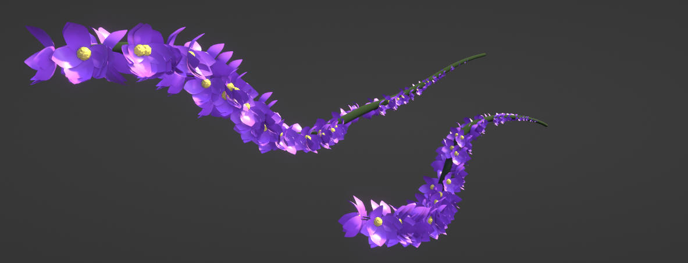

# Drawn curve flowers
Blender 3.0 Geometry Nodes - Beginner tutorial \[Flowers - Draw With Curves\]  
From [https://www.youtube.com/watch?v=Mf2hnWMGKEs](https://www.youtube.com/watch?v=Mf2hnWMGKEs)
-------------------------------------------------------------------------------------------------------------------------------------------------------------------------------

Drawing Curves in blender

Instancing on curves

Scattering on surfaces

Aligning rotation instances

Random attributes