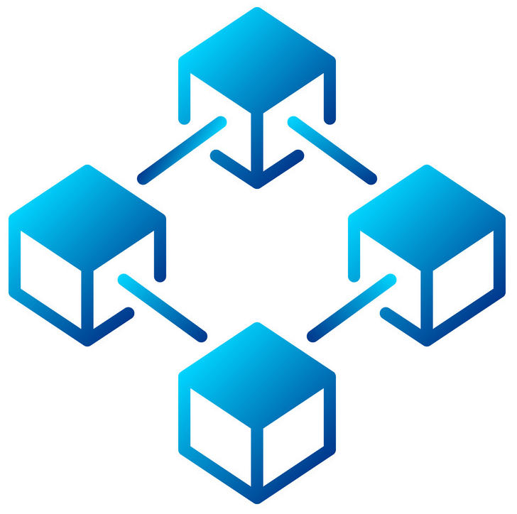

# Crypto and Blockchains
**Crypto and Blockchains**
--------------------------

The 2 big buzzwords of the decade. It's basically a decentralized,

 trustless database. It can track finances and data. Small verifed function can be also be deployed to make it a ‘smarter’ trustless database.

**A “trustless” system**
------------------------

trustless means it can be operated without trusting other parties. Because the blockchain system is incentivised to distribute and verify copies of itself. We can trust that it will not be tampered with.(or it would take an astronomical effort to do so)

**Bitcoin**
-----------

The first widespread application of blockchain tech and the first used crypto-currency. It's just a  public database of bitcoin transfers that allows people to use integers as money.

**Ethereum**
------------

An evolution of the bitcoin protocol. Instead of tracking financial transfers. This ‘database’ will track small ‘objects’. A programming class that contains methods and properties. Effectively creating a trustless public serverless functions.

**NFTs**
--------

A widespread applicaiton type on ethereum. Stores a mapping of address to URLs. Allowing userAccounts to be associated with images.

**More links**
--------------

[**Solidity**](Crypto%20and%20Blockchains/Solidity.md): the main progamming language of ethereum blockchain

[**RemixIDE**](Crypto%20and%20Blockchains/RemixIDE.md): the easiest IDE for solidity

[**NFTs development:**](Crypto%20and%20Blockchains/NFTs.md) guides, workflows  and code snippets

[**Web3js**](Crypto%20and%20Blockchains/Web3js.md)**:** allowing javascript to interact with ethereum.

[**TruffleJS**](Crypto%20and%20Blockchains/Truffle.md): our prev fav solidity IDE