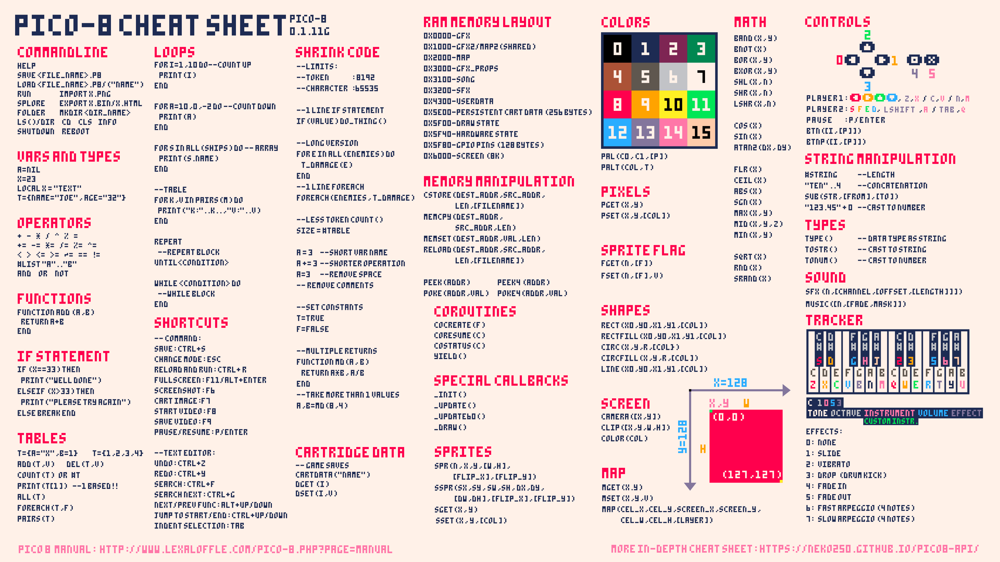

# Pico8
In General
----------

It's a fantasy console that you can develop for. It's a cutely restricted platform to develop games for. Harkening to the good old days of NES with some curated QOL improvements. It uses the [lua programming language](../Automation/Lua.md)

Its Restrictions
----------------

It's meant to emulate the restrictions and simplicity of NES game development. with a limited tile-set, resolution and colors

*   16 colors
*   128x128 tileset
*   8192 tokens of code

Cheatsheet
----------

There is also a [cheat sheet online](https://www.lexaloffle.com/bbs/files/16585/PICO-8_CheatSheet_0111Gm_4k.png)

