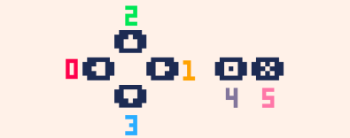

# Developing Games with Pico8
The main functions
------------------

So there are 3 main functions.

```text-plain
function _init()
	-- this is the well.. init, runs once at the start
end

function _update()
	-- runs 30 times a second for every frame
end

function _draw()
	-- runs after update and tries to run 30fps but might skip
end
```

“Object oriented” Programming
-----------------------------

There are no objects. Commonly you just use tables which are basically json-like structures. what people kind do is just create a table for variables and just do var\_methodName(tableInstance, arg1, arg2).

```text-plain
fakeObj = {
	prop1=1,
	prop2=2,
}

function fakeObj_constructor(_prop1, _prop2)
	return {prop1=_prop1, prop2=_prop2}
end

function fakeObj_add(instance)
	return instance.prop1 + instance.prop2
end
```

Input Detection
---------------

Pico 4 directions and 2 inputs



to check for inputs just

```text-plain
btn({index}) -- for return true if pressed
btnp({index}) -- for single button down
```

Collisions
----------

Info taken from this video 

[https://www.youtube.com/watch?v=FHoIriBOpIE](https://www.youtube.com/watch?v=FHoIriBOpIE)

and this

[https://www.lexaloffle.com/bbs/?tid=3116](https://www.lexaloffle.com/bbs/?tid=3116)

Playing sounds
--------------

```text-plain
sfx({soundInt})
```