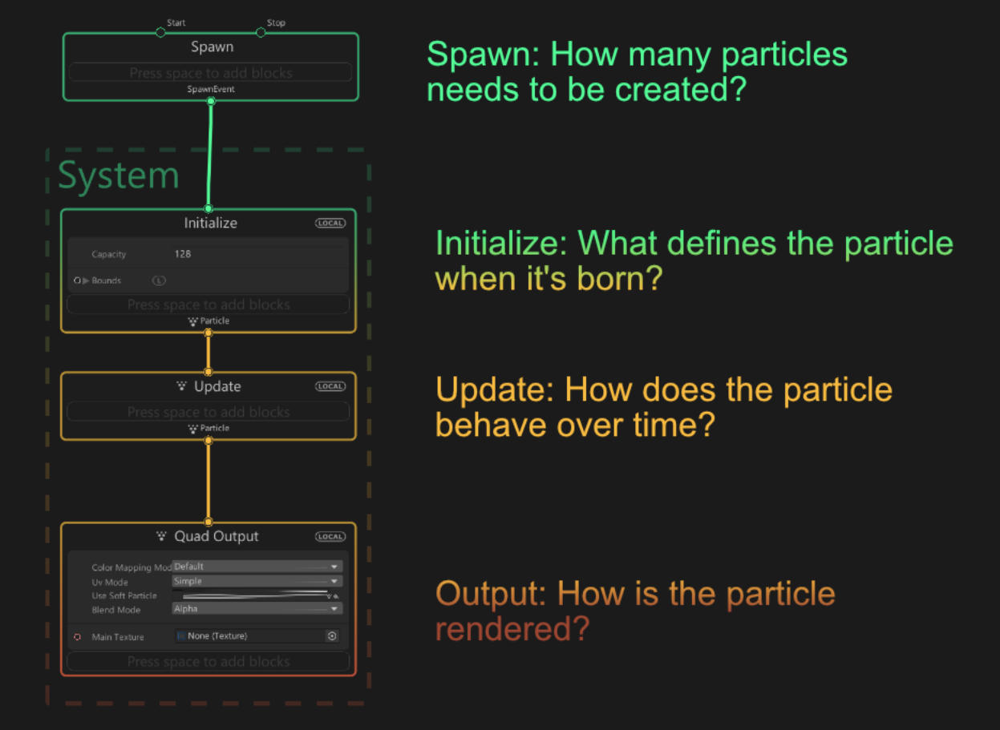

# VFX Graph
VFX Graph
---------

It's essentially a UI to do gpu particles

Creating a graph
----------------

Just right click into a folder > Create > Visual Effects > Visual Effect Graph. You can edit the vfx graph here. Then you can literally drag it into the viewport to spawn an instance

How the graph works
-------------------

The system works from top to bottom. like in the image. Just add blocks to different sections to handle how it applies

### Example from brackeys

[https://www.youtube.com/watch?v=iCEHarLRCzI](https://www.youtube.com/watch?v=iCEHarLRCzI)

Excellent tut on the workflow. Showing how to create trails and secondary particle systems from the main one. 

Creating Parameters
-------------------

Somewhere in the stack you will see parameters with a circle to the left. You can drag them out to create external parameters to control in the inspector. You can change details like texture input, vectors and floats yadda yadda

Mixing with shaders
-------------------