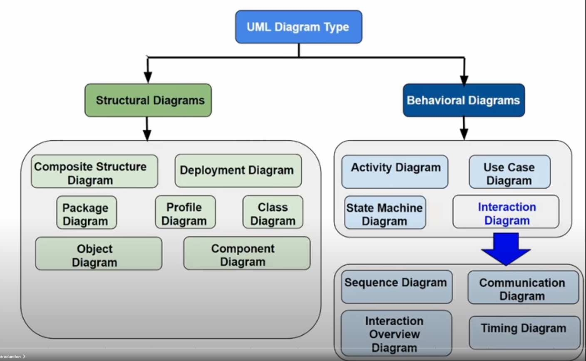

# UML Diagrams
In general
----------

Unified Modelling Languages is just an established set of diagrams to help plan and document software. 

List of Diagrams
----------------

Source 
-------

[https://www.youtube.com/watch?v=WnMQ8HlmeXc](https://www.youtube.com/watch?v=WnMQ8HlmeXc)