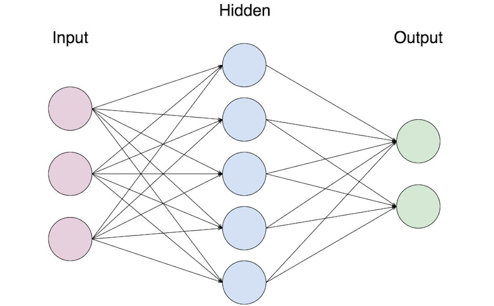
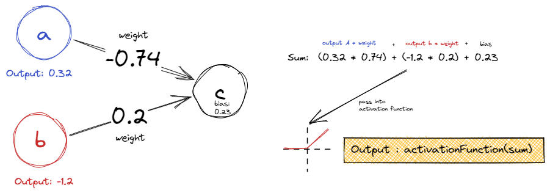
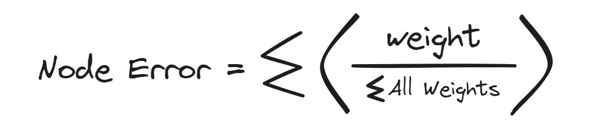

# Neural Networks
Neural Networks
---------------

Are designing algorithms or functions that mimic the human brain neurons. A function that takes in an array of inputs that spits out another array of numbers. In between is a series of nodes/neurons. The input numbers are passed through and calculated with weights and biases and activation functions.

Effectively you can think of them as universeal function approximators

Structure
---------

A neural network is just an multilevel array of neurons. Each neuron in a layer is connected to every other neuron in the next layer and the layer before. 



The input flow (feeding forward)
--------------------------------

You pass in the input numbers in the beginning of the network. and it all just gets calculated through all the weights, biases and activation functions. 

To better understand this let's zoom into a neuron in a layer. 



##### Summing up the previous neurons + bias

for every neuron, it gets the output of all the neurons inputted to it. Then multiplies it by the weight of each connection. Then just sums them all up and finally adding the bias

##### The activation function

this sum then gets passed to the activation function to deliver the final output of this neuron

##### This happens all over

This happens throughout every node of the network

How does it learn?(Back Propagation)
------------------------------------

Generally the desired behavior is a result of the correct settings of each weights and biases. And there are a number of ways to do this. 

### Randomly tweaking. 

This is a scattershot method and way  too unpredictable to be remotely useful

### Gradient Descent

Basically mathematical way of minising the error. The general concept is [here](../../Mathematics/Gradient%20Descent.json). 

Effectively it boils down to 2 formulas to tune the weight and biases

```text-plain
weight += error * input
bias += error
```

Calculating the error is simply just 

```text-plain
error = target - output
```

This what happens in a single neuron

but in what happens across the network? The Error is essentially distributed across the nodes based on it's weights



Sources
-------

*   [Radu's NN from scratch](https://www.youtube.com/playlist?list=PLB0Tybl0UNfYoJE7ZwsBQoDIG4YN9ptyY)
*   [Python NN from scratch](https://www.youtube.com/watch?v=Wo5dMEP_BbI&list=PLQVvvaa0QuDcjD5BAw2DxE6OF2tius3V3)
*   [Sebastian Lague's NN explanation](https://www.youtube.com/watch?v=hfMk-kjRv4c&t=121s)

### From coding train

Probably the best one at explaining this

[From algorithms to neural networks](https://www.youtube.com/playlist?list=PLRqwX-V7Uu6YJ3XfHhT2Mm4Y5I99nrIKX)

[Neural networks and beyond](https://www.youtube.com/playlist?list=PLRqwX-V7Uu6aCibgK1PTWWu9by6XFdCfh)