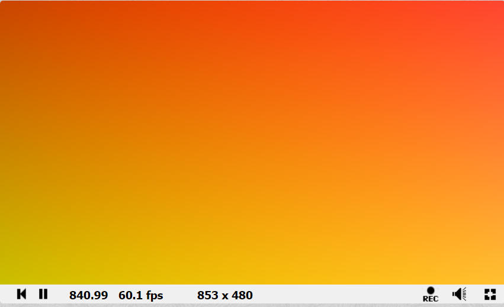

# Default Shadertoy Shader
The Default Shader
------------------



```text-plain
void mainImage( out vec4 fragColor, in vec2 fragCoord )
{
    // Normalized pixel coordinates (from 0 to 1)
    vec2 uv = fragCoord/iResolution.xy;

    // Time varying pixel color
    vec3 col = 0.5 + 0.5*cos(iTime+uv.xyx+vec3(0,2,4));

    // Output to screen
    fragColor = vec4(col,1.0);
}
```

### The function

Everything happens in the mainImage function. Every pixel is calculated with this function. It takes in a vector2 of the pixel coordinates and spits out a vec4 rgba.

### Creating a UV

fragCoord is absolute pixel position but you might want to have the screen normalized so that it scales to the screen canvas. 

in the function above it's the uv is derived from the pixel position divded by the screensize

```text-plain
vec2 uv = fragCoord/iResolution.xy;
```

##### iResolution

it's a global variable for the screensize.

##### Swizzling

`iResolution.xy` is what we call a swizzle. 

`iResolution.xy` is essentially \`newVec = vec2(iResolution.x, iResolution.y);

#### Creating the pixel color