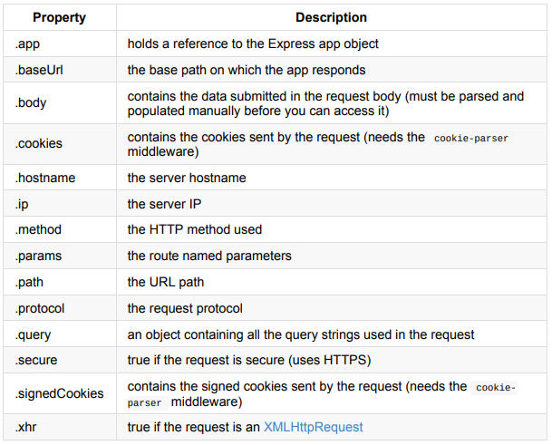

# Express
Express 
--------

Creating a web-server with javascript. Allowing to listen and respond to [http requests](../../Protocols/HTTP.md)

Installation
------------

```text-plain
npm install express -s save
```

Creating a web server
---------------------

Start by importing express and creating the app

```text-plain
// import express
const express = require('express'); // or with es6 import * as express from 'express;
// create express app
const app = express();
```

Then create your end points

```text-plain
app.{httpVerb}('{url}', (req,res)=>{//code to responde})
```

Then start the server

```text-plain
app.listen({port}, ()=>{console.log('successful start')});
```

More about end points
---------------------

Below is an example of an endpoint that returns the string ‘hello world’ back. 

```text-plain
app.get('/', (req, res) => res.send('Hello World!'))
```

To use different verbs: just replace ‘get’ with what you need.

```text-plain
app.get('/', (req, res) => { /* */ })
app.post('/', (req, res) => { /* */ })
app.put('/', (req, res) => { /* */ })
app.delete('/', (req, res) => { /* */ })
app.patch('/', (req, res) => { /* */ })
```

Getting request body 
---------------------

### Install and use the body parser

```text-plain
npm install body-parser
```

```text-plain
import bodyParser from 'body-parser';
app.use(bodyParser.json());

app.post('/', (req, res) => {
	const jsonData = req.body;
})
```

you can get more data from this table



### Handling Responses

```text-plain
res.send('string to send back')
```

To send with response code

```text-plain
res.status(404).send('File not found')
```

To send an empty

```text-plain
res.status(404).end()
```

##### Sending json back

```text-plain
res.json({...obj})
```

##### Sending html back

[read about EJS here](Express/EJS.md)

Dealing with CORS
-----------------

Cross Origin Resource Sharing. Is a security feature for most server frameworks that blocks random url from getting resources from the server. So you need to whitelist the url you getting from or just allow all urls

### Installing CORS for node 

```text-plain
npm install cors
```

### Setting it up in express

`*` will allow all URLs

```text-plain
import cors from 'cors';

// make express app use cors. 
app.use(cors({
  origin: '*'// put urls you want here
}));
```

Serving static directories
--------------------------

Just do this

```text-plain
app.use(express.static('public'))
```

if you want to host it on specific route

```text-plain
app.use('/static', express.static('public'))
```

* * *

> source  
> [https://lcc.lt/assets/pdf\_files/express-handbook.pdf](https://lcc.lt/assets/pdf_files/express-handbook.pdf)