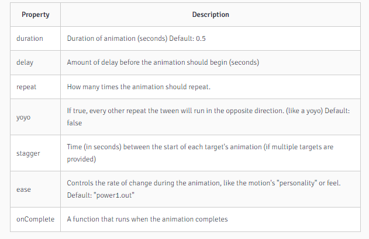

# GSAP
Gsap
----

It's a framework to easily animate html items and more. Like framer but not dedicated to react

### Licensing

### ❗❗❗ Lmao now not permissive anymore stop using this

it's not open-source but for 80% of the cases you can consider it as such. You have to pay for a business license only if we charge end-users regularly like for a subscription.

Installation
------------

```text-plain
npm install gsap --save
```

General usage
-------------

### gsap.to()

Animates from the current state of the object to the state specified

follows the format of :

```text-plain
gsap.to({selector}, {animProperties})
```

example

```text-plain
gsap.to(.className, {duration: 1, x: 50px})
```

above will animate cube to move left 50px on method's call

### gsap.from()

Animates from the specified state to the current state. Like an entrance animation

follows the format of :

```text-plain
gsap.to({selector}, {{animOptions}: {value}, {cssProperty}: {value}})
```

example

```text-plain
gsap.to(.className, {duration: 1, x: 50px})
```

above will animate cube to move right 50px on method's call

### gsap.fromto()

Animates from the specified start and end state

follows the format of :

```text-plain
gsap.to({selector}, {startAnimProperties}, {endAnimProperties})
```

example

```text-plain
gsap.to(.className, {duration: 1, x: 0px}, {duration: 1, x: 50px})
```

above will animate cube to move left 50px on method's call

Animation settings
------------------



Animation events
----------------

**On complete:** just add a fucntion called on complete

```text-plain
gsap.to(.className, {duration: 1, x: 50px, onComplete(){//code here} })
```