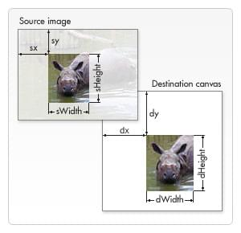

# Canvas Drawing Images
Drawing Bitmap Images
---------------------

```text-plain
ctx.drawImage(image, dx, dy)
ctx.drawImage(image, dx, dy, dWidth, dHeight)
ctx.drawImage(image, sx, sy, sWidth, sHeight, dx, dy, dWidth, dHeight)
```



{image} is an image uri to html image element.

Drawing SVGs
------------

```text-plain
let p = new Path2D('M10 10 h 80 v 80 h -80 Z');
ctx.fill(p);
```