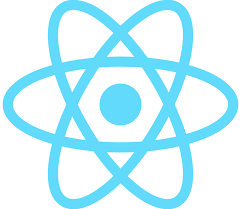

# ReactJS
topics i want to learn next

global state managers like redux

* * *

**React-JS**
------------

A way to build reactive web UI with components(like prefabs in unity).****

**Basic intuition**  
A react component is basically a fucntion that return html. You can add js functionality to this html. Allowing code-reusability and scoping

**Setup**
---------

**The old way**

```text-plain
npx create-react-app <name-of-react-app>
```

The above will create a basic react folder with boilerplate

Starting a dev server

```text-plain
npm start
```

Building the final deployment files

```text-plain
npm build
```

**For the new way use** [**vite**](Vite.md)

**Recommended directory structure**
-----------------------------------

Inside the ./src

\- components: for re-usable single components throughout diff pages  
\- pages: page root and page specific components go here  
\- data: for inputting json data  
\- context: for different context components  
\- hooks: for our custom hooks  
\- utilities: for useful functions. like maybe formatting text

**Deploying to github-pages**
-----------------------------

Tutorial source: [https://www.youtube.com/watch?v=2hM5viLMJp](https://www.youtube.com/watch?v=2hM5viLMJp)

This a tutorial when you use create-react-app. Follow [this](Vite.md) tutorial when you used vite

**1) install gh-pages**

```text-plain
npm install gh-pages — save-dev
```

**2) edit package.json**

create homepage string in the top-level json

```text-plain
"homepage": "https://elbert-git.github.io/{ProjectName}/"
```

add scripts

```text-plain
"predeploy": "npm run build",
"deploy": "gh-pages -d build"
```

**3) run deploy**

```text-plain
npm run deploy
```