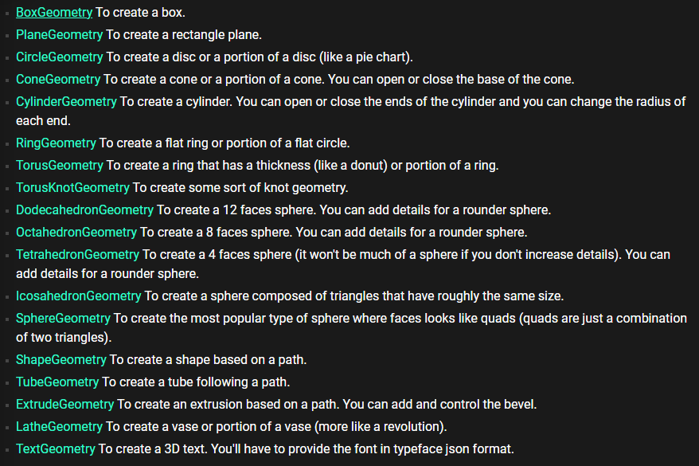

# Geometries
Primitive Geometry 
-------------------

ThreeJS has a couple of primitves you can use. To create them…

```text-plain
const boxGeo = new THREE.BoxGeometry();
```

There's a whole bunch



Buffer Geometry
---------------

You can also generate your own geometry but right now idk why you would