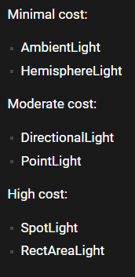
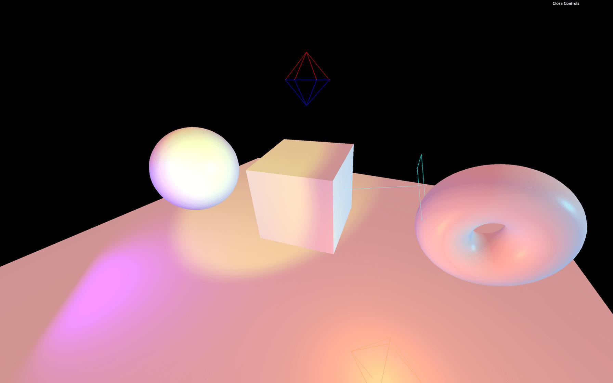

# Lighting
Creating lights
---------------

most of them follows the format off

```text-plain
const light = new THREE.{LightType}({color}, {intensity});
```

Lighting types
--------------

*   ambient light, applies a general colour to everything
*   directional: sun-light
*   hemisphere: cheap sky lighting. a gradient across the Y axis
*   point light: it's a point…
*   rect area
*   spot light

Handling hdri
-------------

### Importing cubemap texture

ThreeJS uses a cubemap texture. use this website to convert textures to the correct for mat

> [https://matheowis.github.io/HDRI-to-CubeMap/](https://matheowis.github.io/HDRI-to-CubeMap/)

then import it by 

```text-plain
import { CubeTextureLoader } from 'three';
const environmentMap = cubeTextureLoader.load([
    '/assets/hdri/px.png',
    '/assets/hdri/nx.png',
    '/assets/hdri/py.png',
    '/assets/hdri/ny.png',
    '/assets/hdri/pz.png',
    '/assets/hdri/nz.png'
])
```

### Global renderer environment map

You can set a global environmap by setting it as the scene's environment

```text-plain
scene.environment = environmentmap;
```

### Per object environment map

You can also set it per object to optimise performance. By setting it onto devices that need it

```text-plain
meshObject.material.envMap = environmentMap;
```

### HDRI intensity. 

By default you can't change lighting intensity of an hdri but you can brighten up the whole image by [tone mapping](ToneMapping.md)

Performances ranked
-------------------



Depth Fog
---------

```text-plain
// create fog with colour and and near and far planes
const fog = new THREE.Fog('#262837', 1, 15)
// add to scene
scene.fog = fog

// change renderer background colour
renderer.setClearColor('#262837')
```

Light helpers
-------------



You can add light helpers to see where they are. Just making them visible for debug

```text-plain
const hemisphereLightHelper = new THREE.HemisphereLightHelper(hemisphereLight, 0.2)
scene.add(hemisphereLightHelper)

const directionalLightHelper = new THREE.DirectionalLightHelper(directionalLight, 0.2)
scene.add(directionalLightHelper)

const pointLightHelper = new THREE.PointLightHelper(pointLight, 0.2)
scene.add(pointLightHelper)
```

Miscellaneous
-------------

*   You can bake light in blender for better performance