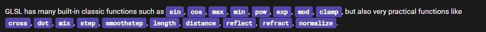

# GLSL syntax
Variables
---------

### Creating a variable

```text-plain
{type} varName = value
```

It's statically typed

### Data types

*   floats
*   integers
*   booleans

### Converting between types

```text-plain
const int = int(3.23);
```

### Vector types

```text-plain
vec3 bar = vec3(1.0, 2.0, 3.0);
vec2 foo = vec2(1.0, 2.0);
vec4 foo = vec4(1.0, 2.0, 3.0, 4.0);
```

Functions
---------

```text-plain
{returnType} someFunc()
{
    float a = 1.0;
    float b = 2.0;
    return a + b;
}
```

Just declare the return type and initiate the function like how you woudl

### Adding arguments

```text-plain
float add(float a, float b)
{
    return a + b;
}
```

### built-in functions

