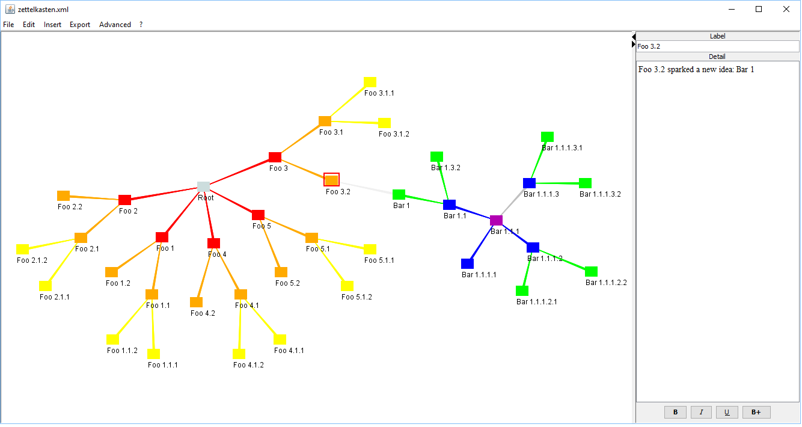

# Zettelkasten
**What is this?**
----------------------------------------------------------------------------------------------

A way of organizing thoughts and notes. Aimed at efficient information gathering and structured to allow new links to organically form. Allowing thoughts and notes to be captured in a single note. that has links and references to everything other notes. organically creating a insightful links between topics. 

**Who created it**
------------------

Niklas Luhman was the most prolific author to use this. Written a large amount of books he credited his productivity to this system. 

**Why people are interested**
-----------------------------

Probably due to the visually beautiful networks created by this system.  But also when done right. This is an efficient way of note-taking and organizing thought. 

**Luhman's workflow**
---------------------

Literature notes  
As you consume content. You create notes that you want to remember. Putting it into your own words. 

References  
Create a note for important sources that can be linked to. This note should just be brief glimpse into the source. 

Fleeting notes  
This is like his inbox. His bin of random ideas. In this system he can link the cards he needs

Permanent notes  
This is like his technical notes. Solidifying a structure seen in the inbox, literature and fleeting notes

**In essence**  
It's all about capturing important thoughts. Linking them organically as you see fit. Then canonizing their structure into permanent notes

**How I want to use it**
------------------------

What do I want to get from it?  
I think I just want a better note editor which is this trilium program. But I hope this improves our note-taking abiility.  

The workflow I would use  
I would disregard the fleeting notes. I have my own system for it. 

Some tips to bound this to useful tool and not a useless time-sink  
Use it as your new technical notes first. Then let the benefits come Organically

* * *

> Understanding note-taking | Zettelkasten: [https://www.youtube.com/watch?v=-r6fnC5lVfE](https://www.youtube.com/watch?v=-r6fnC5lVfE)
> 
> Zettelkasten Note-Taking Method: Simply Explained: [https://www.youtube.com/watch?v=rOSZOCoqOo8;](https://www.youtube.com/watch?v=rOSZOCoqOo8;)